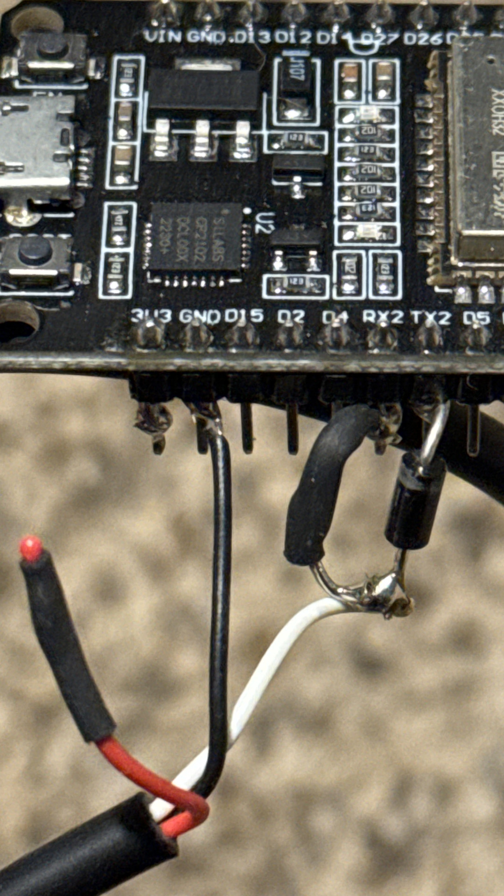

<h1 align="center">N64 PC Input Bridge</h1>

<p align="center">
  <strong>A Python + ESP32 bridge for sending controller input from a PC to original Nintendo 64 hardware with very low latency.</strong>
</p>

<p align="center">
  It can be used for live PC-driven control and, with minor changes, as a hardware output bridge for TAS playback or AI-generated inputs.
</p>

---

## Overview

This project lets a PC control a real Nintendo 64 by sending controller input to an ESP32 over USB, which then translates that input into valid N64 controller signals. The result is a surprisingly low-latency bridge between Python and original hardware.

It can be used for normal PC-driven input, and with some modification it can also be adapted to feed inputs from a TAS pipeline or an AI model into a real N64.

A large amount of the timing research and protocol understanding came from [qwertymodo’s N64 controller documentation](https://www.qwertymodo.com/hardware-projects/n64/n64-controller), which was essential for getting the signaling right.

---

## Hardware Notes

The N64 controller cable has three wires, but only two are needed here:

- **Ground**
- **Data**

The **red wire** is the controller power line, but it is not used in this setup because the ESP32 is powered directly over USB from the PC.

You can either:

- sacrifice an old N64 controller, or
- buy an extension cable and cut it for wiring

In this build:

- the **black wire** is connected to **GND**
- the **white data wire** is connected to the ESP32’s **RX2**
- the same data line is also connected to **TX2 through a Schottky diode**

### Why the Schottky diode is needed

The N64 data line is effectively a **shared single-wire communication line**. The ESP32 needs to both:

- **listen** to the line, and
- **drive** the line when responding

You do not want the TX pin fighting the bus directly or interfering with the receive path. The Schottky diode helps isolate the transmit side so the ESP32 can pull the line during transmission without creating a direct electrical conflict between **TX**, **RX**, and the N64 data line.

A **Schottky diode** is used because it has:

- a **low forward voltage drop**
- **fast switching behavior**

Both are helpful for the tight timing requirements of the N64 protocol.

---

## Software Notes

On the software side, the implementation avoids slow software timing loops and instead relies on ESP32 hardware peripherals for much tighter timing.

In the RMT-based version, the ESP32 uses its **RMT peripheral** to:

- decode incoming N64 command pulses
- generate correctly timed response pulses

Meanwhile, Python continuously updates the controller state over USB serial.

This is much more reliable than trying to bit-bang the protocol entirely in software.

---

## Use Cases

- **Live PC-driven controller input**
- **Tool-assisted speedrun playback**
- **AI or scripted input pipelines**
- **Experimentation with real N64 hardware control**

---

## Wiring Summary

```text
N64 GND (black)  -> ESP32 GND
N64 DATA (white) -> ESP32 RX2
ESP32 TX2        -> Schottky diode -> N64 DATA (white)
USB from PC      -> ESP32 power + serial data
<p align="center">
  
</p>

